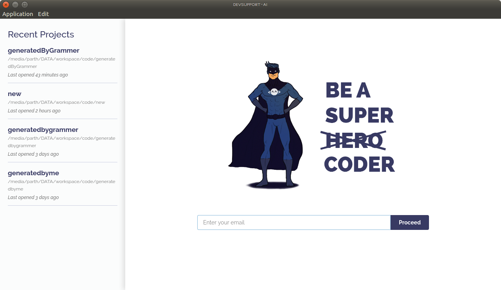
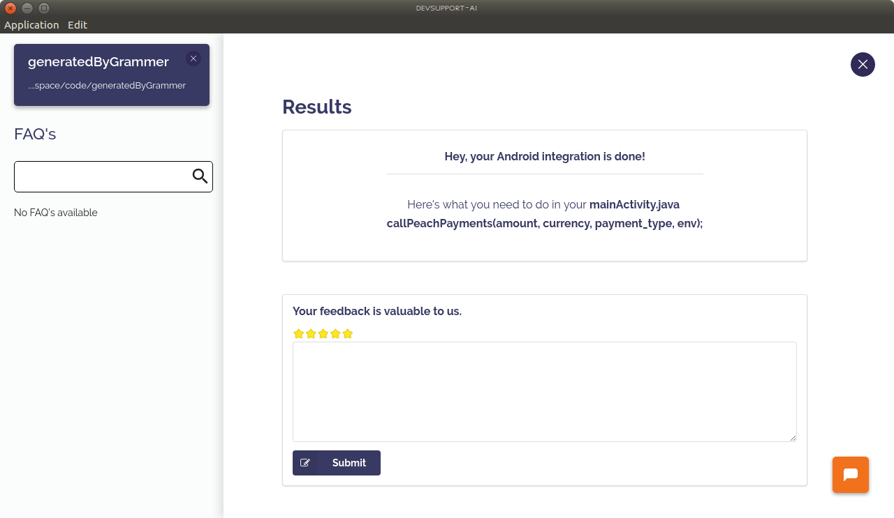

# Peach Payments Android Integration


## What do I need?

* URL pointing to action.php


## Steps to follow

* [Download the Devsupport AI](https://github.com/artpar/devsupport/releases/latest). tool. Install the .exe if you are on Windows, mac.zip if you are on Mac and .deb if you are on Linux. You should see a screen below:
  
  
* Link the home directory of your Android project.
  

* Click on Integrate button.

* Search for Peach Payments when asked for Product you'd like to integrate.

* Click on 'Peach Payments Android Integration'.

* Enter URL pointing to action.php and also your company name(without spaces) same as you entered in PHP integration.

* Devsupport AI will show list of injections it will do in the selected files.

* After selecting suitable files click on Apply changes.

* If everything went well, you should see a success screen like this:
  

## Calling Payments

In the activity you selected and just call InstamojoPay as shown below:

`callPeachPayments(amount, currency, payment_type, env);`

for e.g.

* `callPeachPayments("95.00", "EUR", "DB", Config.TEST);` for Debit payment on test.

* `callPeachPayments("95.00", "EUR", "PA", Config.PROD);` for Preauthorization payment on production.

You will receive a call back on the below function:

````
private void initListener() {
            peachListener = new PeachListener() {
                @Override
                public void onSuccess(String response) {
                    Toast.makeText(getApplicationContext(), "Success:" + response, Toast.LENGTH_LONG)
                            .show();
                }
    
                @Override
                public void onFailure(int code, String reason) {
                    Toast.makeText(getApplicationContext(), "Failed Reason:" + reason, Toast.LENGTH_LONG)
                            .show();
                }
            };
        }
````

### Response Format

status=success:idontKNOW:(


##Need help?

You can chat with us using the orange icon on the tool or write us an email at support@devsupport.ai - happy to help!


