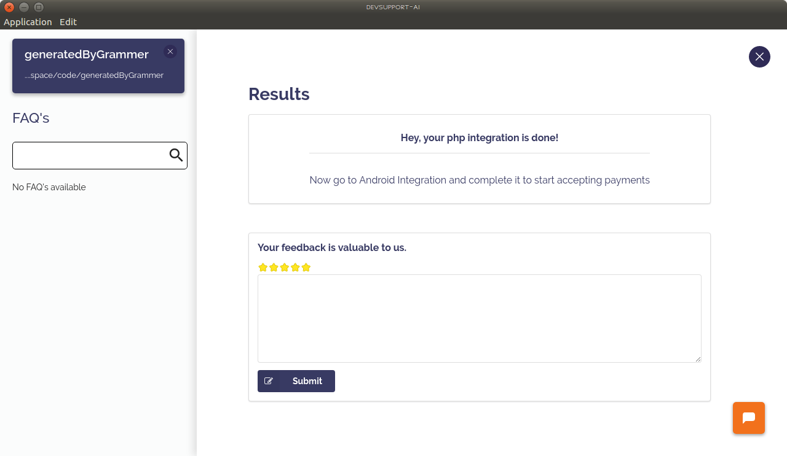

# Peach Payments PHP Integration For Mobile SDK

At Peach Payments, we are committed to offer a seamless integration experience to our developers.

We are happy to launch Devsupport AI - a bot programmer that integrates PayU with your code in few minutes.

At the end of this, you can test accepting payments on Peach Payments Sandbox Environment.

## What do I need?

* User Id
* Password
* Entity Id

Get your Entity Id from [Peach Payments Dashboard](test.ppay.io "Peach Payments Dashboard")

## Steps to follow

* [Download the Devsupport AI](https://github.com/artpar/devsupport/releases/latest). tool. Install the .exe if you are on Windows, mac.zip if you are on Mac and .deb if you are on Linux. You should see a screen below:
  
 
* Link the home directory of your Android project.
  

* Click on Integrate button.

* Search for Peach Payments when asked for Product you'd like to integrate.

* Click on 'PHP for mobile SDK'.

* Enter your User Id, Password and Entity Id. If you enter wrong key combination, the tool will throw an error!.

* Download the notify.php and host it on your server.

* Enter the publicly available URL for the notify.php you just downloaded and also enter your company name(without spaces).
It will be used for callback.

* Download the action.php, host it and give its URL in next step.

**Note that both notify.php and action.php contain your Sandbox Credentials. DO NOT Modify them.**

* If everything went well, you should see a success screen like this:
  

* Proceed to Android Integration to complete the flow.

## Switching to Production

Get your production credentials from [Production Peach Payments dashboard](https://www.ppay.io/merchant/#/index).

Change the following in action.php and notify.php:

* Change URL from "https://test.oppwa.com/" to "https://oppwa.com/".

* Change User Id to Production User Id.

* Change Password to Production Password.

* Change Entity Id to Production Entity Id.

##Need help?

You can chat with us using the orange icon on the tool or write us an email at support@devsupport.ai - happy to help!

